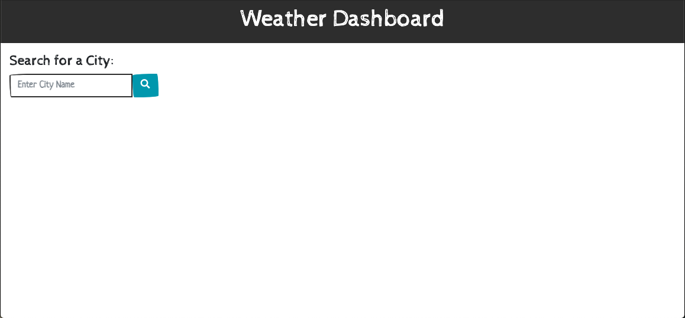
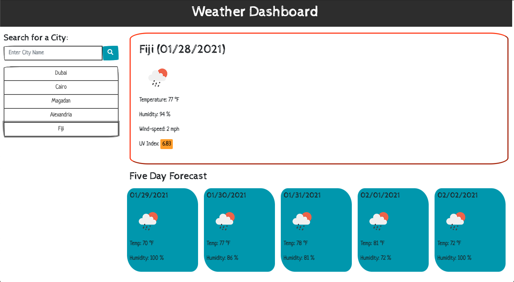
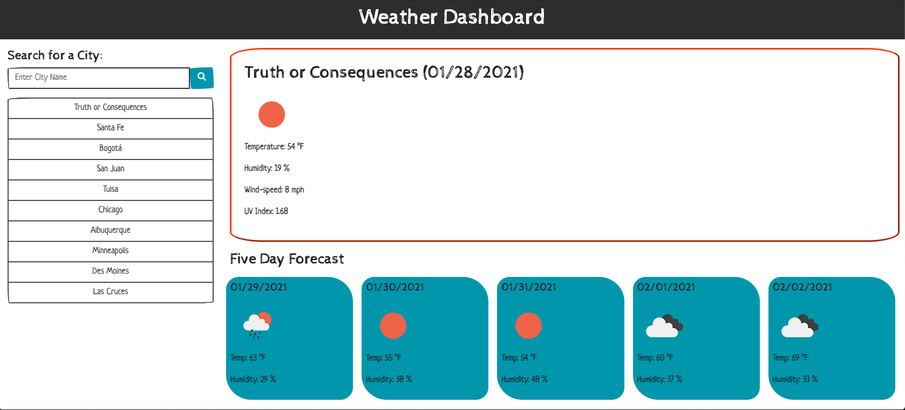

# Weather Dasboard

## Description

Planning for the weather has never been easier!  Whether the user needs a quick look at today's weather in their location, or needs the weather and forecast to aid in future travels, Weather Dashboard provides an add-free and accurate snap-shot of the weather for any city in the world.

## Resources and Functionality

This application utilizes the OpenWeatherMap and Moment.js APIs, HTML, CSS, and is dynamically powered by jQuery. Design resources include: Bootswatch themes for Bootstrap and FontAwesome.

After entering a city name into the input field and clicking the search icon, the application returns the current weather and forecast for that city. City names are stored in the browser's local storage and in buttons beneath the input-field.

On clicking a button with a saved search-value, the application will return current weather information for the saved location. Should the user close and re-open the application or refresh the browser, data from the most recent city searched will display in the dashboard, and buttons with previous search-values will display in the sidebar.

All previous searches will be saved until the user clears their local storage.

## For Development

In future developement, I would like to include more granular error handling on the API call that would catch and return invalid entries to the user (mis-spellings, non-existant cities etc). I would also like to incorporate a "clear all results" button that would clear local storage and remove the previous search buttons. Lastly, I would like to add some functionality (possibly a drop-down or hamburger menu) to the header that would improve the appearance of the application on smaller screens.

## Screenshots of Application

Before search results populate, the user will see a simple input field and header.

As the user enters cities, data for the newest city entered will display in the dashboard and previous search values will be saved on the buttons generated in the side-bar(from most to least recent). Clicking on any of the buttons will display current data for the listed city.

\*UV index values above 3 are color coded in accordance with the WHO UV index scale.

At present, there is no limit to the number of cities the application will save. However, no matter how many cities were stored, the application will always pull the most recent search on re-load.

## Link to Weather Dashboard

[Weather Dashboard](https://jnel-221.github.io/whatever-the-weather/)
